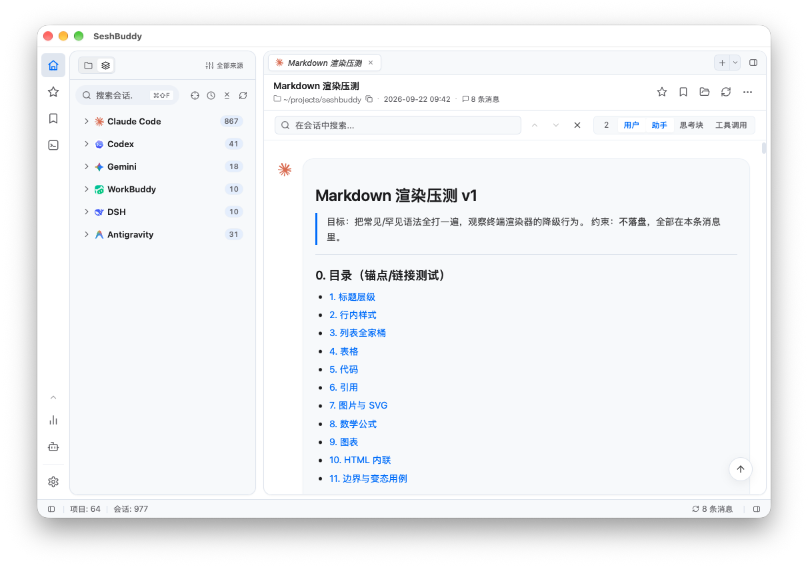

<p align="center">
  
</p>

<h1 align="center">SeshBuddy</h1>

<p align="center">
  <b>面向 AI 编码代理的桌面会话浏览器与工作台</b>
</p>

<p align="center">
  <a href="README.md"></a>
  <a href="README.zh-CN.md"></a>
</p>

<p align="center">
  <a href="https://seshbuddy.huangy.top/"><b>下载 macOS / Windows / Linux 版</b></a>
</p>

<p align="center">
  <a href="https://seshbuddy.huangy.top/"></a>
  <a href="https://github.com/huangy7/seshbuddy/releases/latest"></a>
  <a href="LICENSE"></a>
  
  <a href="https://github.com/huangy7/seshbuddy/releases"></a>
  
</p>

<p align="center">
  
</p>

SeshBuddy 是一个原生的桌面工作台，用来管理你和 AI 编码代理一起写下的会话。它直接读取 Claude Code、Codex、Gemini、Antigravity、WorkBuddy、DSH、OpenCode、Cursor、Pi、Aider、Kimi、Goose 与 Grok 已经写在磁盘上的会话数据与日志，在本地建立索引，把浏览、检索、归档与检视集中到一处——外加一个本地反向代理，让你看清 agent 究竟往网络上发了什么。

## 核心功能

| 功能 | 说明 |
| :--- | :--- |
| **多 CLI 会话浏览** | 在一棵树里浏览、整理、收藏与归档 **Claude Code / Codex / Gemini / Antigravity / WorkBuddy / DSH / OpenCode / Cursor / Pi / Aider / Kimi / Goose / Grok** 的历史会话。 |
| **统一全文检索** | 基于本地 **Tantivy** 索引，覆盖每一条提问、回复、工具调用与代码块；会话标题匹配也并入同一结果集。 |
| **API 反向代理与流量检视** | `seshbuddy-proxy` 位于 CLI 与厂商端点之间（支持 **Claude Code** 与 **Codex**），可查看请求 / 响应体、耗时与 token 用量。一键开启，一键还原原始端点。 |
| **Monaco 编辑器与 Git Diff** | 并排差异视图加语法高亮，不用离开应用就能看清 agent 改了什么。 |
| **桌面助手** | 基于历史会话提问、总结工作、提炼要点。每个回答都标注来源，可跳回对应会话。 |

## 隐私

会话不会离开你的机器。没有账号，也没有遥测。对外请求只有你主动触发或配置的三种——可选的模型定价目录（`models.dev`）、你自己的 API 端点，以及指向 GitHub Releases 的更新检查。

## 从源码构建

需要 Node.js v20+、stable 版 Rust 工具链，以及对应操作系统的 [Tauri 依赖](https://v2.tauri.app/start/prerequisites/)。

```bash
git clone https://github.com/huangy7/seshbuddy.git
cd seshbuddy
npm install
npm run tauri dev
```

`npm run tauri dev` 会先构建 `seshbuddy-proxy` 边车程序——桌面端在运行时会拉起它。

依赖安装、调试、测试与发版流程见 [DEVELOPMENT.md](DEVELOPMENT.md)。

## 贡献者

<p align="center">
  <a href="https://github.com/huangy7/seshbuddy/graphs/contributors">
    
  </a>
</p>

## 许可

基于 [MIT](LICENSE) 许可发布。

---

<p align="center">
  由 <a href="https://github.com/huangy7">huangy7</a> 开发与维护
</p>
